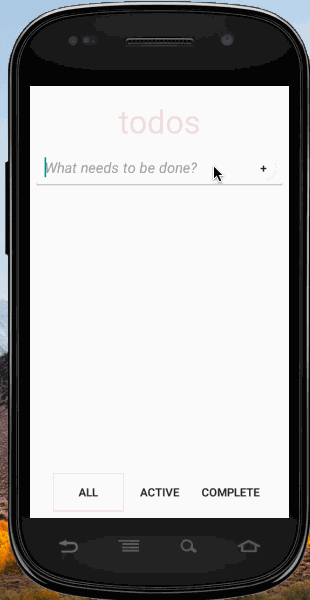

# Pre-work - *Android TodoMVC*

**TodoMVC** is an android app inspired by http://todomvc.com/. It allows you to add, edit and remove todo items and filter by all, completed or active.

Submitted by: **Morgan Plant**

Time spent: **8** hours spent in total

## User Stories

The following **required** functionality is completed:

* [x] User can **successfully add and remove items** from the todo list
* [x] User can **tap a todo item in the list and bring up an edit screen for the todo item** and then have any changes to the text reflected in the todo list.
* [x] User can **persist todo items** and retrieve them properly on app restart

The following **optional** features are implemented:

* [ ] Persist the todo items [into SQLite](http://guides.codepath.com/android/Persisting-Data-to-the-Device#sqlite)
* [ ] Improve style of the todo items in the list [using a custom adapter](http://guides.codepath.com/android/Using-an-ArrayAdapter-with-ListView)
* [ ] Add support for completion due dates for todo items (and display within listview item)
* [ ] Use a [DialogFragment](http://guides.codepath.com/android/Using-DialogFragment) instead of new Activity for editing items
* [ ] Add support for selecting the priority of each todo item (and display in listview item)
* [x] Tweak the style improving the UI / UX, play with colors, images or backgrounds

The following **additional** features are implemented:
* [x] uses Room ORM for persisting todos
* [x] filters between Active, Completed, and All todo states
* [x] dispays create and last updated times

## Video Walkthrough

Here's a walkthrough of implemented user stories:

GIF created with [LiceCap](http://www.cockos.com/licecap/).

## Project Analysis

As part of your pre-work submission, please reflect on the app and answer the following questions below:

**Question 1:** "What are your reactions to the Android app development platform so far? Compare and contrast Android's approach to layouts and user interfaces in past platforms you've used."

**Answer:**
Android studio makes building android apps easier with the autocompletion and linting features. I like having a strongly typed language, but I am a still new to a lot of the core android/java paradigms. I am still trying to wrap my head around some of the multi-threaded aspects of andoird development, especially since you get those for free in the browser. Also I noticed in setting up Room there was a bit of magic going on there too. Overall I think it is fun learning a new approach to building UIs. Java 8 seems promising with some of the more functional languages features, but seems like there is still a lot of celebration needed to get some simple components working.

**Question 2:** "Take a moment to reflect on the `ArrayAdapter` used in your pre-work. How would you describe an adapter in this context and what is its function in Android? Why do you think the adapter is important? Explain the purpose of the `convertView` in the `getView` method of the `ArrayAdapter`."

**Answer:** The ArrayAdapter takes a collection and effifiently reuses elements to only display the items on screen. `getView` is used to "inflate" the data and display the element on screen and convertView gives you the old view to reuse. In my mind the adapter is similar to React's virtual dom in that elements are recycled and you can never guarantee a react view and a element will remain associated with eachother throughout the life of your app.

## Notes

Describe any challenges encountered while building the app.

Java is verbose so it take a lot of mental capacity to read through long code examples on SO and find relevant answers. Also Java introduces a lot more data structures which makes it a bit harder to know if you're using the right tool for the job. I mentioned previously about threads and a lack of functional language features (looks like Java 8 has lambas though!)

## License

    Copyright [2018] [Morgantheplant]

    Licensed under the Apache License, Version 2.0 (the "License");
    you may not use this file except in compliance with the License.
    You may obtain a copy of the License at

        http://www.apache.org/licenses/LICENSE-2.0

    Unless required by applicable law or agreed to in writing, software
    distributed under the License is distributed on an "AS IS" BASIS,
    WITHOUT WARRANTIES OR CONDITIONS OF ANY KIND, either express or implied.
    See the License for the specific language governing permissions and
    limitations under the License.
